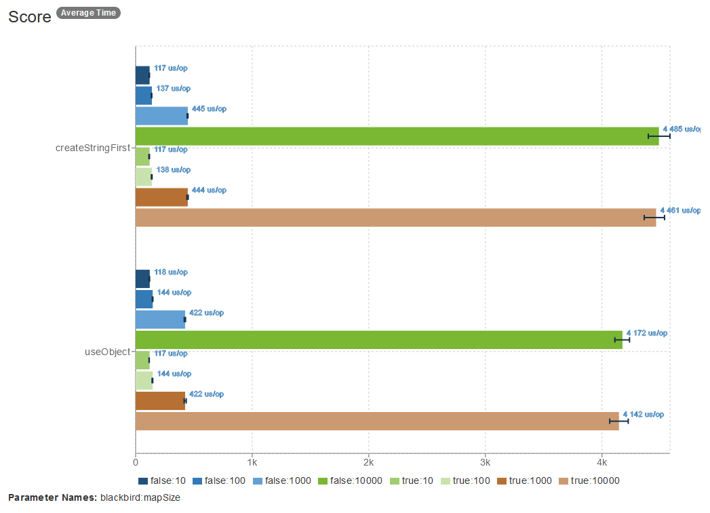
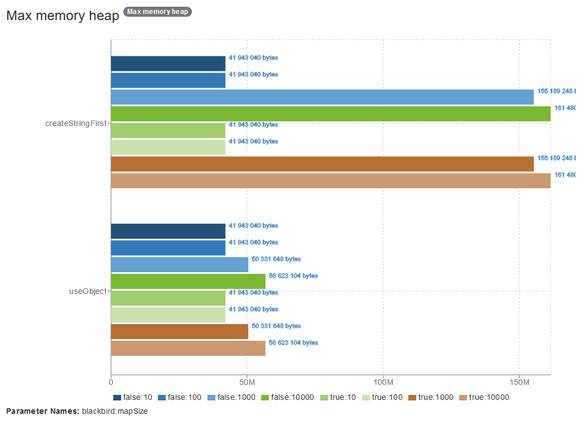
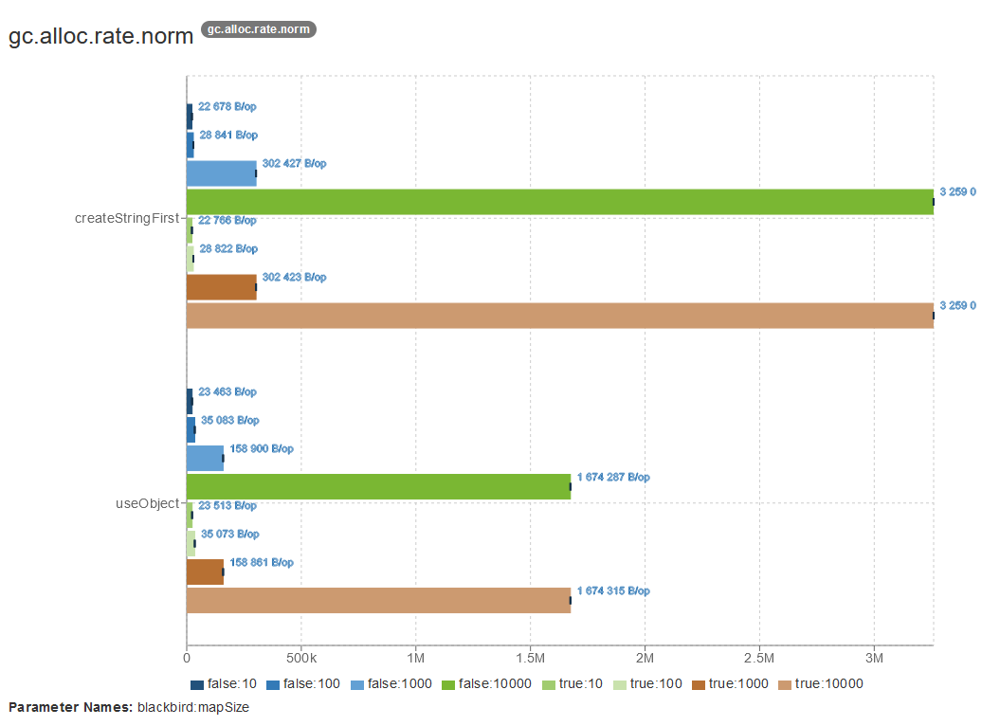

# WebClient Jackson benchmark

I recently run into the issue of a software with Spring's [WebClient](https://docs.spring.io/spring-framework/reference/web/webflux-webclient.html) running into memory issues.

I wanted to compare runtime and memory usage of, using `objectMapper.writeValueAsString` with handing the object to serialize directly to `bodyValue`.
I also checked if [Blackbird](https://github.com/FasterXML/jackson-modules-base/tree/2.19/blackbird) could offer any improvement.

I used [JMH](https://github.com/openjdk/jmh) to run a micro benchmark for different sizes of objects.

You can find the main logic of the test in [BenchmarkApplicationTests.java](src/test/java/com/tobijdc/webclient/benchmark/BenchmarkApplicationTests.java).

## How to run

Requirements:

* Java 21+.
* A server to run against (`localhost:80`)
  * I used [blackhole from Adobe](https://github.com/adobe/blackhole).

On Windows run: `.\mvnw.cmd test`

On Linux/MacOs run: `./mvnw test`

And wait for one and half hours our so. (Reducing the number of forks or iterations will cut down on runtime, with less precise results).

## Results

It looks like for large objects, passing the object directly to `bodyValue` performs significantly better.

You can find the detailed results from my machine in `results-tobijdc.json`.

## Acknowledgements

Charts created with [https://jmh.morethan.io](https://jmh.morethan.io).
